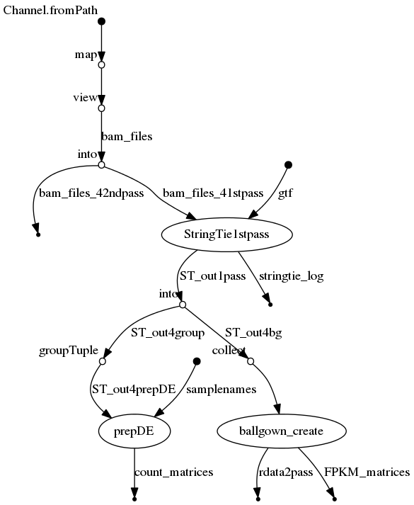

# RNAseq-transcript-nf
## RNA-seq transcript-level analysis nextflow pipeline
[](https://circleci.com/gh/IARCbioinfo/RNAseq-transcript-nf/tree/master)
[](https://hub.docker.com/r/iarcbioinfo/rnaseq-transcript-nf/)


## Description
Performs transcript identification and quantification from a series of BAM files using StringTie, following the Nature Protocol paper (Pertea et al. 2016; doi:10.1038/nprot.2016.095)

The twopass mode involves 4 steps:
- a 1st pass identifies new transcripts for each BAM file
- a merging step merges the list of transcripts of each BAM file
- a 2nd pass quantifies transcripts from the merged file (without new transcript discovery) in each sample


## Dependencies 
1. Nextflow: for common installation procedures see the [IARC-nf](https://github.com/IARCbioinfo/IARC-nf) repository.
2. [StringTie](http://ccb.jhu.edu/software/stringtie/)
3. [R](https://cran.r-project.org/) with packages [tidyverse](https://www.tidyverse.org/), [ballgown](https://www.bioconductor.org/packages/release/bioc/html/ballgown.html), and [tximeta](https://www.bioconductor.org/packages/release/bioc/html/tximeta.html)

### twopass mode
In twopass mode, original and novel transcript annotations gtfs are compared with
4. [gffcompare](https://ccb.jhu.edu/software/stringtie/gffcompare.shtml)

**A conda receipe, and docker and singularity containers are available with all the tools needed to run the pipeline (see "Usage")**

## Input 
  | Type      | Description     |
  |-----------|---------------|
  | input_folder    | input folder with BAM files |
  

## Parameters
* #### Mandatory
| Name      | Example value | Description     |
|-----------|---------------|-----------------| 
| --gtf    |  ref_annot.gtf  | annotation .gtf file |

  
  * #### Optional
| Name      | Default value | Description     |
|-----------|---------------|-----------------| 
|--input_file | null |  File in TSV format containing columns "ID" (sample ID), "bam" (path to RNA-seq BAM file), and "readlength" (the sample's read length) |
| --output_folder |      . | folder where output is written |
|--readlength | 75 | Read length for count computation (only if input_folder is used) |
| --mem  | 2 | memory |
| --cpu  | 2 | number of CPUs | 
| --prepDE_input | none | File given to script prepDE from StringTie |
| --annot_organism, --annot_genome, --annot_provider, --annot_version, --ref | "Homo sapiens","hg38", Unknown, Unknown, Unknown | metainformation stored in SummarizedExperiment R object |

Note that you have two ways of providing input: specifying a folder (then all bam files will be processed) or a file with columns "ID", "bam", and "readlength" (in any order). The file method is preferred when bam files do not all have the same read length.

Also note that of the metainformation used for the SummarizedExperiment object creation, only --annot_organism and --annot_genome are actually used to retrieve information about the annotation in the R script; the other parameters (including the reference) are just written in the metainformation of the object. When no genome or organism is specified, the script attempts to retrieve automatically the metainformation from the gtf file, and otherwise falls back to defaults (hg38 and Homo sapiens).

* #### Flags

| Name  | Description |
|-----------|-------------| 
|--help | print usage and optional parameters |
|--twopass | Enable StringTie 2pass mode |
	
## Usage 
  ```
  nextflow run iarcbioinfo/RNAseq-transcript-nf --input_folder BAM/ --output_folder out --gtf ref_annot.gtf
  ```
  
 To run the pipeline on a series of BAM files in folder *BAM* and an annotation file ref_annot.gtf, one can type:
```bash
nextflow run IARCbioinfo/RNAseq-transcript-nf -r v2.2 -profile singularity --input_folder BAM/ --output_folder out --gtf ref_annot.gtf 
``` 
To run the pipeline without singularity just remove "-profile singularity". Alternatively, one can run the pipeline using a docker container (-profile docker) the conda receipe containing all required dependencies (-profile conda).
  
## Output 
 | Type      | Description     |
  |-----------|---------------|
  |expr_matrices/*_matrix.csv | matrices with gene and transcript expression in different formats (counts, FPKM, and TPM) |
  | logs/  | StringTie logs |
  | stats/    | gatk stats files from mutect |
  | intermediate_files/expression_matrices/ | same as expr_matrices/*_matrix.csv but with one matrix per read length  |
  | intermediate_files/sample_folders/ | (see below) |
  | (optional) gtf/ | if the twopass mode is enabled, stringtie_annot.gtf contains identified genes and transcripts and folder gffcmp stats comparing original gtf with stringtie gtf (see below) |
  | Robjects | R data objects in ballgown format (bg.rda, containing both gene- and transcript-level information) and SummarizedExperiment format (gene*.SE.rda and transcript*.SE.rda)|
          
The sample_folders/ folder contain subfolders (sample/ST1pass/ or sample/ST2pass depending on the twopass option), which themselves contain a folder for each sample, with:
- an expression quantification file (\*_gene_abund.tab) with FPKM and TPM
- an annotation file (\*_merged.gtf)
- Ballgown input files for statistical analysis using R package ballgown (exon/transcript and intron/transcript ids correspondance e2t.ctab and i2t.ctab, exon, intron, and transcript-level quantification files e_data.ctab, i_data.ctab, and t_data.ctab) 

The gtf/gffcmp folder contains an annotation file with the discovered and known transcripts (gtf/gffcmp_merged.annotated.gtf), along with information about naming (gffcmp_merged.stringtie_merged.gtf.refmap, gffcmp_merged.tracking) and positions (gffcmp_merged.loci, gffcmp_merged.stringtie_merged.gtf.tmap), and some statistics (gtf/gffcmp_merged.stats)

See the [SummarizedExperiment documentation](https://bioconductor.org/packages/release/bioc/vignettes/SummarizedExperiment/inst/doc/SummarizedExperiment.html) for details about the structure. In our case, the data contains:
- 4 assays accessible using function *assay()* (raw_counts, length--with transcript lengths--, abundance_FPKM, and abundance_TPM)
- metadata about package versions, gtf (reference genome, version, annotation ) accessible using function *metadata()* 
- feature data (transcript and gene name, id) accessible using function *rowData()* and *rowRanges()* (detailed information)
- sample data (name and read length) accessible using function *colData()*

## Directed Acyclic Graph
[](http://htmlpreview.github.io/?https://github.com/IARCbioinfo/template-nf/blob/master/dag_stringtie_1pass.html)

## Contributions

  | Name      | Email | Description     |
  |-----------|---------------|-----------------| 
  | Nicolas Alcala*    |  AlcalaN@fellows.iarc.fr | Developer to contact for support |
  
## References
Pertea, M., Kim, D., Pertea, G. M., Leek, J. T., & Salzberg, S. L. (2016). Transcript-level expression analysis of RNA-seq experiments with HISAT, StringTie and Ballgown. Nature protocols, 11(9), 1650-1667.
	
