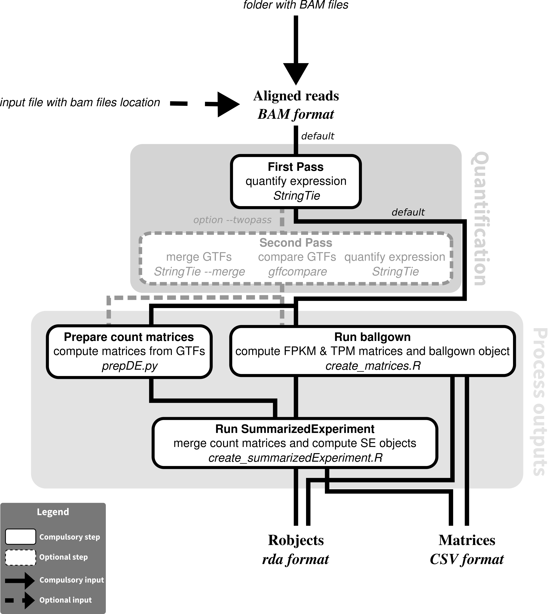

# RNAseq-transcript-nf
## RNA-seq transcript-level analysis nextflow pipeline



## Description
Performs transcript identification and quantification from a series of BAM files using StringTie, following the Nature Protocol paper (Pertea et al. 2016; doi:10.1038/nprot.2016.095)

## Dependencies 

1. This pipeline is based on [nextflow](https://www.nextflow.io). As we have several nextflow pipelines, we have centralized the common information in the [IARC-nf](https://github.com/IARCbioinfo/IARC-nf) repository. Please read it carefully as it contains essential information for the installation, basic usage and configuration of nextflow and our pipelines.
2. External software:
- StringTie

You can avoid installing all the external software by only installing Docker. See the [IARC-nf](https://github.com/IARCbioinfo/IARC-nf) repository for more information.


## Input 
  | Type      | Description     |
  |-----------|---------------|
  | input_folder    | input folder with BAM files |
  
  Specify the test files location

## Parameters

  * #### Mandatory
| Name      | Example value | Description     |
|-----------|---------------|-----------------| 
| --param1    |            xx | ...... |
| --param2    |            xx | ...... |
  
  * #### Optional
| Name      | Default value | Description     |
|-----------|---------------|-----------------| 
| --param3   |            xx | ...... |
| --param4    |            xx | ...... |

  * #### Flags
  
Flags are special parameters without value.

| Name      | Description     |
|-----------|-----------------| 
| --help    | Display help |

	
## Usage 
  ```
  
  ```
  
## Output 
  | Type      | Description     |
  |-----------|---------------|
  | output1    | ...... |
  | output2    | ...... |


## Detailed description (optional section)
...

## Directed Acyclic Graph
[](http://htmlpreview.github.io/?https://github.com/IARCbioinfo/template-nf/blob/master/dag.html)

## Contributions

  | Name      | Email | Description     |
  |-----------|---------------|-----------------| 
  | Nicolas Alcala*    |  AlcalaN@fellows.iarc.fr | Developer to contact for support |
  
## References (optional)
Pertea, M., Kim, D., Pertea, G. M., Leek, J. T., & Salzberg, S. L. (2016). Transcript-level expression analysis of RNA-seq experiments with HISAT, StringTie and Ballgown. Nature protocols, 11(9), 1650-1667.
	