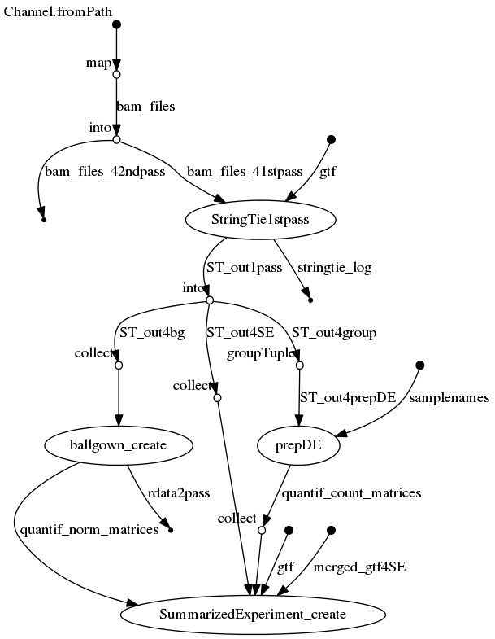

# RNAseq-transcript-nf
## RNA-seq transcript-level analysis nextflow pipeline


## Description
Performs transcript identification and quantification from a series of BAM files using StringTie, following the Nature Protocol paper (Pertea et al. 2016; doi:10.1038/nprot.2016.095)

## Dependencies 

1. This pipeline is based on [nextflow](https://www.nextflow.io). As we have several nextflow pipelines, we have centralized the common information in the [IARC-nf](https://github.com/IARCbioinfo/IARC-nf) repository. Please read it carefully as it contains essential information for the installation, basic usage and configuration of nextflow and our pipelines.
2. External software:
- StringTie

You can avoid installing all the external software by only installing Docker. See the [IARC-nf](https://github.com/IARCbioinfo/IARC-nf) repository for more information.


## Input 
  | Type      | Description     |
  |-----------|---------------|
  | input_folder    | input folder with BAM files |
  


## Parameters
* #### Mandatory
| Name      | Example value | Description     |
|-----------|---------------|-----------------| 
| --gtf    |  ref_annot.gtf  | annotation .gtf file |


  * #### Optional
| Name      | Default value | Description     |
|-----------|---------------|-----------------| 
|--input_file | null |  File in TSV format containing ID, path to BAM file, and readlength per sample |
| --output_folder |      . | folder where output is written |
|--readlength | 75 | Mean read length for count computation |
| --mem  | 2 | memory |
| --cpu  | 2 | number of CPUs | 

Note that you have two ways of providing input: specifying a folder (then all bam files will be processed) or a file with columns "ID", "bam", and "readlength" (in any order). The file method is preferred when bam files do not all have the same read length.

* #### Flags

| Name  | Description |
|-----------|-------------| 
|--help | print usage and optional parameters |
|--twopass | Enable StringTie 2pass mode |
	
## Usage 
  ```
  nextflow run iarcbioinfo/RNAseq-transcript-nf --input_folder BAM/ --output_folder out --gtf ref_annot.gtf
  ```
  
## Output 
- StringTie logs in folder logs/
- matrices with gene and transcript expression in different formats (counts, FPKM, and an R ballgown object *bg.rda* with all information) in folder expr_matrices
In addition, in a folder is created in sample/folders for each sample, with:
- an expression quantification file (\*_gene_abund.tab) with FPKM and TPM
- an annotation file (\*_merged.gtf)
- Ballgown input files for statistical analysis using R package ballgown (exon/transcript and intron/transcript ids correspondance e2t.ctab and i2t.ctab, exon, intron, and transcript-level quantification files e_data.ctab, i_data.ctab, and t_data.ctab) 

- if the twopass mode is enabled, an annotation file with the discovered and known transcripts (gtf/gffcmp_merged.annotated.gtf), along with information about naming (gffcmp_merged.stringtie_merged.gtf.refmap, gffcmp_merged.tracking) and positions (gffcmp_merged.loci, gffcmp_merged.stringtie_merged.gtf.tmap), and some statistics (gtf/gffcmp_merged.stats)


## Detailed description
This workflow involves 3 steps:
- a 1st pass identifies new transcripts for each BAM file
- a merging step merges the list of transcripts of each BAM file
- a 2nd pass quantifies transcripts from the merged file (without new transcript discovery) in each sample

## Directed Acyclic Graph
[](http://htmlpreview.github.io/?https://github.com/IARCbioinfo/template-nf/blob/master/dag_stringtie_1pass.html)

## Contributions

  | Name      | Email | Description     |
  |-----------|---------------|-----------------| 
  | Nicolas Alcala*    |  AlcalaN@fellows.iarc.fr | Developer to contact for support |
  
## References (optional)
Pertea, M., Kim, D., Pertea, G. M., Leek, J. T., & Salzberg, S. L. (2016). Transcript-level expression analysis of RNA-seq experiments with HISAT, StringTie and Ballgown. Nature protocols, 11(9), 1650-1667.
	
